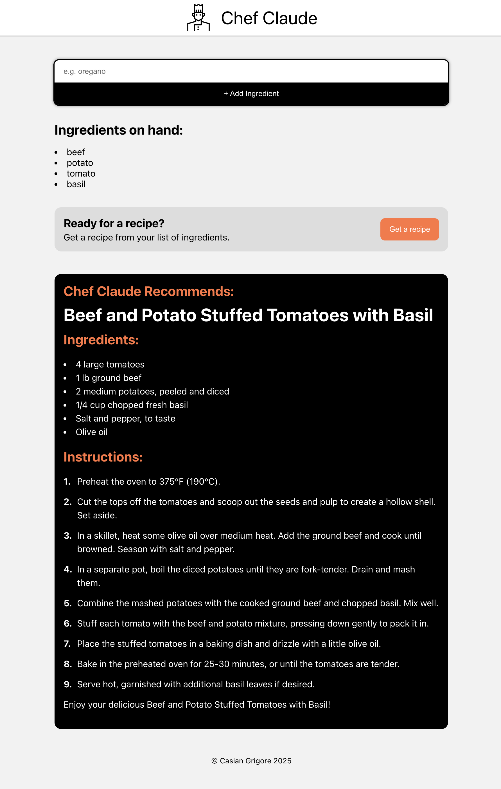

# Chef Claude

Chef Claude is a web application that generates recipes based on user-provided ingredients. It consists of a React frontend deployed on Vercel and a Node.js/Express backend API deployed on Render. The backend uses the OpenAI API to generate recipes dynamically.

## Screenshot



## Project Structure

```markdown
chef-claude/
├─ frontend/ # React frontend
│ ├─ package.json
│ └─ src/
│
├─ server/ # Node/Express backend API
│ ├─ package.json
│ └─ server.js
│
├─ package.json # optional root package.json
├─ README.md
```

## Frontend

-   **Framework:** React
-   **Deployment:** Vercel (`https://chef-claude-lyart.vercel.app`)
-   **Features:**

    -   Users can input a list of ingredients.
    -   Fetches recipes from the backend API.
    -   Displays recipes in markdown using `react-markdown`.

-   **Environment Variable:**

    -   `REACT_APP_API_BASE=https://chef-claude-f34x.onrender.com`

## Backend API

-   **Framework:** Node.js + Express
-   **Deployment:** Render (https://chef-claude-f34x.onrender.com)
-   **Features:**
    -   `POST /api/getRecipe` endpoint.
    -   Accepts JSON body: `{ "ingredients": ["eggs", "flour", "milk"] }`.
    -   Generates recipes using `OpenAI GPT-3.5-turbo`.
    -   Handles `CORS` for the React frontend.

## Deployment

### Frontend:

-   **Vercel:**
    -   GitHub repo: `chef-claude/frontend`

### Backend:

-   **Render:**
    -   Root Directory: `server`
    -   Build Command: `npm install`
    -   Start Command: `npm start`
    -   Environment Variable: `OPENAI_API_KEY`

## Summary of Accomplishments

-   Migrated API from Vercel serverless function → dedicated Express server.
-   Configured CORS properly for React frontend.
-   Backend deployed on Render, fully live and accessible.
-   Frontend deployed on Vercel, fetching recipes from Render API.
-   Local development environment set up with npm run dev for server and npm start for frontend.

-   Eliminated serverless deployment errors completely.

## Next Steps / Improvements

-   Add recipe images using OpenAI image API.

-   Cache generated recipes to reduce API calls.

-   Add user accounts and save favorite recipes.

-   Add input validation and better UI for ingredient selection.

## Live Sites:

-   **Frontend:** https://chef-claude-lyart.vercel.app
-   **Backend:** https://chef-claude-f34x.onrender.com
